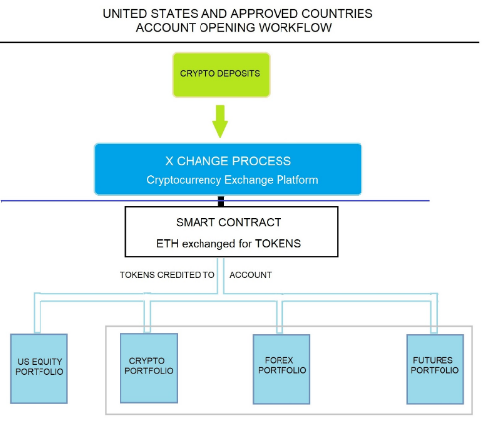
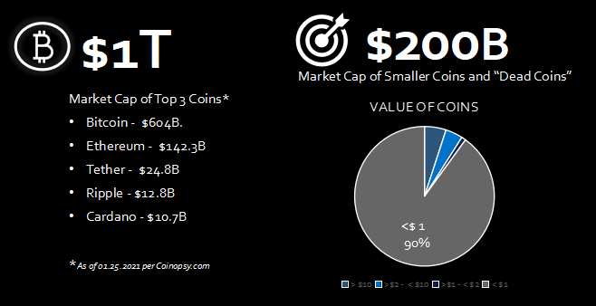
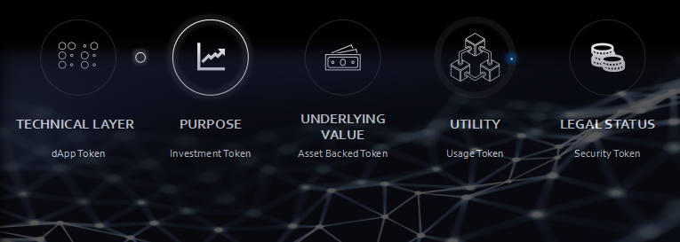
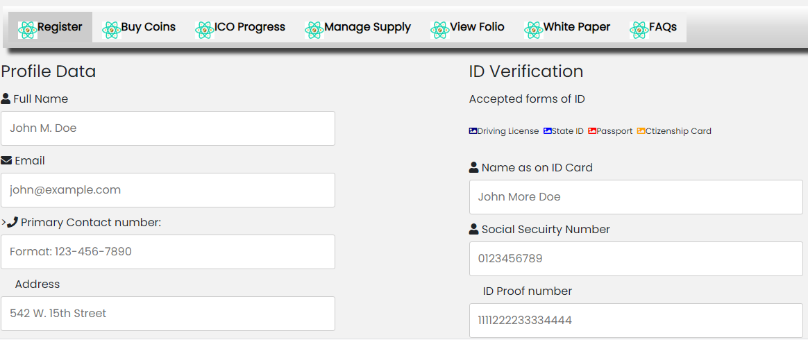

# SLPR Security Token Offering and dApp

</img>

<h2> Problem Statement </h2>

<b>Challenges with Crypto Asssets</b>

- <strong> Volatility Of Prices </strong>
    - The cryptocurrency market is characterized by steep rises and sudden dramatic falls. An interesting quirk of cryptocurrency is that multiple coins tend to rise and fall in tandem. Except for a few who hold the likes of BTC and ETH, others invested in Crypto currencies have lost lot of money.

- <strong> No Intrinsic Value </strong>
    - Other than a handfull of Cryptocurrencies like Bitcoin, Ethereum and few others, 90% of the tradable Crupto currencies are valued at less than a Dollar and most of them are even less than a dime. These are mostly the utility tokens with no instrinsic value but are locked in with a hope the prices will increase riding on Bitcoin and Ethereum spikes. 

- <strong> Zero returns </strong>
    - Unlike Traditional market investments, Crypto Currencies offer no returns or dividends as Crypto asset is not a fiat currency and is only limited to monetary value when converted to a cash. Speculation and hope drives the investors to venture into crypto currency. In reality people have spent their hard earned money in coins that have neither increased in value nor they got any ROI for many years, becoming a dead investment. 

- <strong> Conversion Issues </strong>
    - In addition to lack of legislation, the other big obstacle that stands in the way of cryptocurrency holders like Bitcoin traders and users is the challenge to spend their holdings. Conversion remains a huge hurdle for Bitcoin vendors. As Bitcoin is not a fiat currency and is only limited to monetary value when converted to a cash equivalent, not many vendors go for its conversions for other cryptocurrency types.

 

<h2>The Solution </h2>

<b> Proposal  </b>

<table><tr><td>

</img>

</td><td width="600">

- Develop a smart contract and dApp that will allow the cryptocurrency user to Invest their preferred cryptocurrency for a Security token. The funds raised via the cryptoCurrency will then be invested in Traditional Markets

    - SLPR Coin is a SECURITY TOKEN OFFERING to raise funds for investment in to diverse portfolio in traditional markets, Offers CryptoCurrency holders to covert their high risk and under-performing crypto assets into Traditional investements. 

    -  The workflow process allows for for US based and approved foreign country investors to exchange their cryptocurrency from ETH into SLPR tokens . This would enable the client to get access to the managed portfolio strategies in one or all four markets , and would allow the investor to exit back through the exchange with SLPR tokens that have realized an increase in value. The investor would then be able to exchange the token back into their cryptocurrency of their choice at their preferred currency exchange.

    - The token investor will have the option to have any dividends either reinvested back into the strategy or receive the dividends after the initial holding period as an income distribution either in the form of Ethers or in Fiat Currencies, minimizing the price volatility and maximizing the returns leveraging their crupto Assets.

    - Crypto Asset holders who are interested to invest in this offering will need to comply with KYC, Suitability and AML requirements as slated by SEC and Federal regulations.

    - funds collected will be invested in to a diverse portfolio with complete visibility to the fund performance, very much akin to ETF or Unit investment funds. 

    - Traditional Investment Portfolio will be built and executed using Trading strategies and algorithms offering complete transparancy for the token investors with access to backtesting results, trading strategies employed and strategy tearsheet. 

</td></tr></table>

 

<b> Market Opportunity </b>

<table><tr><td>

- Out of 1691 Tradable tokens in coin Exchanges, only 5% of the coins have valaue more than $10. 90% of the Crypto currencies are valued at less than $1, locing in $ 200B market cap with small and dead coins.

- There are very few security token offerings like SLPR coin, but they are focused on specific market say Bullion or Commodites but not diversified the way our solution proposes. 

</td><td>

</td></tr></table>

 

<b> SLPR Coin - Token Classification</b>
 

SLPR Coin is a Crypto security: an asset on a blockchain that, in addition, offers the prospect of future payments, for example a share of profits.

- 

 

## SEC and Federal Regulations 

KYC, AML and Suitability Requirements 

KYC Requirements

- The SEC requires that a new customer provide detailed financial information that includes :
    - name
    - date of birth 
    - identification numbers
    - address
    - employment status 
    - annual income
    - net worth
    - investment objectives
 

- Suitability Requirements 
    - the client's age, 
    - other investments, 
    - tax status, 
    - financial needs, 
    - investment experience, 
    - investment time horizon, 
    - liquidity needs, 
    - risk tolerance. 

 

Suitability Obligations

- Rule 2111 lists the three main suitability obligations for firms and associated persons.

    - Reasonable-basis suitability requires a broker to have a reasonable basis to believe, based on reasonable diligence, that the recommendation is suitable for at least some investors.  Reasonable diligence must provide the firm or associated person with an understanding of the potential risks and rewards of the recommended security or strategy.
    - Customer-specific suitability requires that a broker, based on a particular customer’s investment profile, has a reasonable basis to believe that the recommendation is suitable for that customer. The broker must attempt to obtain and analyze a broad array of customer-specific factors to support this determination.
    - Quantitative suitability requires a broker with actual or de facto control over a customer’s account to have a reasonable basis for believing that a series of recommended transactions, even if suitable when viewed in isolation, is not excessive and unsuitable for the customer when taken together in light of the customer’s investment profile.

 

AML requirements

- Each member shall develop and implement a written anti-money laundering program reasonably designed to achieve and monitor the member's compliance with the requirements of the Bank Secrecy Act (31 U.S.C. 5311, et seq.), and the implementing regulations promulgated thereunder by the Department of the Treasury. Each member's anti-money laundering program must be approved, in writing, by a member of senior management. The anti-money laundering programs required by this Rule shall, at a minimum,

    - Establish and implement policies and procedures that can be reasonably expected to detect and cause the reporting of transactions required under 31 U.S.C. 5318(g) and the implementing regulations thereunder;
    - Establish and implement policies, procedures, and internal controls reasonably designed to achieve compliance with the Bank Secrecy Act and the implementing regulations thereunder;
    - Provide for annual (on a calendar-year basis) independent testing for compliance to be conducted by member personnel or by a qualified outside party, unless the member does not execute transactions for customers or otherwise hold customer accounts or act as an introducing broker with respect to customer accounts (e.g., engages solely in proprietary trading or conducts business only with other broker-dealers), in which case such "independent testing" is required every two years (on a calendar-year basis);
    - Designate and identify to FINRA (by name, title, mailing address, e-mail address, telephone number, and facsimile number) an individual or individuals responsible for implementing and monitoring the day-to-day operations and internal controls of the program (such individual or individuals must be an associated person of the member) and provide prompt notification to FINRA regarding any change in such designation(s);
    - Provide ongoing training for appropriate personnel; and
    - Include appropriate risk-based procedures for conducting ongoing customer due diligence, to include, but not be limited to:
        - Understanding the nature and purpose of customer relationships for the purpose of developing a customer risk profile; and
        - Conducting ongoing monitoring to identify and report suspicious transactions and, on a risk basis, to maintain and update customer information. For purposes of paragraph (f)(ii), customer information shall include information regarding the beneficial owners of legal entity customers (as defined in 31 CFR 1010.230(e)).

 

## Technologies Used 

 Prerequisites

<table><tr>

<td><tr>
<td> Solidity "^5.17.0" </img></td>
<td> Truffle "^1.0.17" </img></td>
<td> Ganache "^5.17.0" </img></td>
<td> Meta Mask "^5.17.0" </img></td>
</tr><tr>
<td> OpenZeppelin "^2.5.1" </img></td>
<td> Webpack "^4.32.2" </img></td>
<td> Web3 "^1.2.5-rc.0" </img></td>
<td> Python "^3.5.0" </img></td>
</tr><tr>
<td> React Js </img></td>
<td> Javascript  </img></td>
<td> HTML5 </img></td>
<td> CSS </img></td>
</tr>
</table>

 

## Designing the Solution 

<b>Smart Contracts</b>

- 

Contract Features

    - CROWDSALE: Base architecture for crowdsales. Sets up a wallet to collect funds. Framework to send Ether to the Smart Contract & compute the amount of Tokens disbursed based on the rate.

    - MINTEDCROWDSALE: The contract will mint Tokens anytime they are purchased, instead of having a preset total supply. The total amount of tokens in distribution is determined by how many are actually sold.

    - TIMEDCROWDSALE: Sets parameters to start (openingTime) and end (closingTime) the Crowdsale.

    - CAPPEDCROWDSALE: Sets the max amount of runds it can raise in the Crowdsale.

    - WHITELISTCROWDSALE: Sets parameters to fullfill KYC requirements. Match contributions in the Crowdsale to real people. Investors must be WhiteListed before they can purchase Tokens.

    - STAGED CROWDSALE: Creates 2 stages (pre-sale and public sale) to set rates where investors can receive more Tokens in the pre-sale vs the public sale. In pre-sale, funds go to the wallet, not to the refund escrow vault.

    - REFUNDABLECROWDSALE: Sets a minimum goal of funds to raise in the Crowdsale. If goal isn't reached, it will refund investors.

    - DISTRIBUTION & VESTING: Set amount of Tokens to distribute to Founders, Company, and Public.

    

 

- 

 ERC20 SLPRCoin 

    - [SLPRCoin](SmartContracts/SLPRcoin.sol) simply inherits the  standard `ERC20Mintable` and `ERC20Detailed` contracts, by taking the  the `decimals` parameter which is hardcoded to `18` in our solidity program.

    - This contract initiates ERC20Mintable contract by passing the Name, Symbol and decimals parameters.

    

 

- 

 SLPRCoinCrowdsale

    - [SLPRCoinCrowdsale](SmartContracts/SLPRcoinCrowdSale.sol) inherits the following OpenZeppelin contracts:

        - `Crowdsale`

            - Sets up the basic crowdsale architecture and passes essential functions into our contract such as `buyTokens`, `_preValidatePurchase`, `_deliverTokens`, `_processPurchase`, and `_forwardFunds`, which make the token verification, purchasing, and deposit possible. In addition, it provides the `rate`, `wallet`, and `token` parameters which are passed into our contract's `constructor`.   

        - `MintedCrowdsale`

            - Enables the crowdsale contract to inherit the `mint` properties from our token's `ERC20Mintable` component. This allows the contract to be the minter during the duration of the crowdsale. At the end of the sale, the contract transfers the `minter` to the `wallet` once the `finalization` function is called.

        - `CappedCrowdsale`

            - Sets a `cap` to limit the funds raised during our crowdsale. Uses the `_preValidatePurchase` function to check that the `cap` isn't exceeded before allowing the purchase to move forward.

        - `TimedCrowdsale`

            - Allows the contract to set up `open` and `close` times for our fund-raising period. Uses the `_preValidatePurchase` function to enforce the `onlyWhileOpen` modifier before allowing the purchase to proceed.

        - `WhitelistCrowdsale`

            - Designates the crowdsale contract as a `WhitelistAdmin` so that it can set accounts as `WhiteListed` once they pass KYC, Suitability, and AML requirements during the Registration process.

        - `RefundablePostDeliveryCrowdsale`

            - Since `RefundablePostDeliveryCrowdsale` inherits the `RefundableCrowdsale` contract, which requires a `goal` parameter, we must call the `RefundableCrowdsale` constructor from  `SLPRCoinCrowdsale` constructor as well as the others. `RefundablePostDeliveryCrowdsale` does not have its own constructor, so we will just use the `RefundableCrowdsale` constructor that it inherits.

            - If the `RefundableCrowdsale` constructor is not called with proper arguments, the `RefundablePostDeliveryCrowdsale` will fail since it relies on it (it inherits from `RefundableCrowdsale`), and does not have its own constructor.

        - Additional Contract Properties:

            - `TokenTimelock` to freeze funds during trading period using the `releaseTime` parameter. Allows us to ensure that investors do not withdraw or trade their tokens before series ends.
            - `Contributions mapping` to maintain public records of all investor contributions, which can be called using the `getUserContribution` function created within the contract.
            - `Capped Crowdsale` to designate variable token pricing during `PreICO` and `ICO` stages. Uses the `enum` value type to create stages as user-defined types.
            - `Distribution Percentages` to allocate specific percentages in our Token Issuance strategy across `Public Sale`, `Founders`, `Foundation`, and `Partners` funds.
    

 

- 

SLPRCoinCrowdsaleDeployer

    - In this contract, The parameters for all of the features of our crowdsale, such as the `name`, `symbol`, `wallet` for fundraising, `goal`, Cap, rate, etc. are defined in the SLPRCoinSaleDeployer contract which instantiates SLPRCoinCrowdSale and SLPRCoin contracts by passing these parameters at the deployment time. 

    - We will use `now` and `now + 24 weeks` to set the sale Opening and closing times  in our `SLPRCoinCrowdsaleDeployer` contract.

    

 

 <b> Designing Algorithmic Trading </b>

 

- <b>Strategies Explored</b>
    - Machine Learning
    - Simple Moving Average Crossover
    - Momentum
 

- <b>Python Tools Utilized</b>
    - Alpaca API for data acquisition
    - NumPy & Pandas for data cleaning
    - Oanda v20 API for trading
    - TPQOA wrapper classes for logic
    - The ZeroMQ Module for sockets
    - Plotly Dash for visualization and dashboard implementation

 

- <b>Points of Interest</b>
    -   The machine learning trader performed at 55% accuracy in sample and 53% accuracy out of sample on the ability to predict the direction of the price movement of the EUR/USD pair
    - Transaction costs heavily affected portfolio performance, and further study into the development of a stronger model with better hyper-parameters is underway.

 

- <b>Problems & Solutions</b>
    - Trying to code during closed markets
        *Solution*: Create a fake ticker class, run it on a published socket and subscribe to it via test code. The fake ticker class would use a Euler discretization of geometric Brownian motion to simulate random price movements.
    - Receiving socket messages and running code with the same file.
        *Solution*: A combination of multithreading, multiprocessing, and asynchronous computing was researched. Solutions will be implemented and live in updated versions.

 

<b>dApp Development</b>
  

* 

 Setting up the development environment

    There are a few technical requirements before we can develop and deploy the dApp. Please install the following:

    - install Node.js and node package manager npm by downloading it from https://npmjs.org

        Node.js v8+ LTS and npm (comes with Node)
        Once we have those installed, we only need one command to install Truffle:

           `npm install -g truffle`

    - Creating a dApp project directory.
        - create a directory in your preferred folder of choice and then moving inside it and run the following command from the powershell from this folder:

           `truffle init`

        -   This will create default truffle directory structure containing the following:

            - contracts/: Contains the Solidity source files for our smart contracts. There is an important contract in here called Migrations.sol, which we'll talk about later.
            - migrations/: Truffle uses a migration system to handle smart contract deployments. A migration is an additional special smart contract that keeps track of changes.
            - test/: Contains both JavaScript and Solidity tests for our smart contracts
            truffle-config.js: Truffle configuration file
    
    - Writing the smart contract

        - Refer to the Smart Contract development section above

    - Compiling and migrating the smart contract

        - To compile a Truffle project, change to the root of the directory where the project is located and then follow the instructions as documented at https://www.trufflesuite.com/docs/truffle/getting-started/compiling-contracts

       
           `truffle compile`

    - Testing the smart contract
    
    - Creating a user interface to interact with the smart contract
    - Using Javascript, HTML5 Document Object Model and W3 CSS, we have developed the Contract forms dynamically without having to create each of the form elements. For more information on DOM and CSS, please refer to https://w3schools.com. A snapshot of the user interface of our contract is given below:

    - 

    - deploying the contract to localtestnet

    -   Once the contracts are compiled, run the following command on powershell:

           `truffle migrate`

        - This will bundle the contracts source (json files) into budle folder that can be accessed via node.js that runs on webpack or the liteserver, a local instance of web server

    - Interacting with the dapp in a browser

        - initiate the webpack server that will launch the html code interacting with javascript and smart contract at the backend. 

        - In the webpack.config file located int he dapp folder, enter the network address e.g: localhost and portnumber: 8080 with index.html as the firt page to be opend and specify where the index.js that interacts swith the browser and smartcontract in the backend. 

        
           `npm run start`

        - where start is the webpack handler invoking hte localhost:portnumber.

 

 <b> Deploying the dApp and Solidity Contracts to live Testnet</b>

- Open the MetaMask plugin on your Browser and select the preferred testnets like Kovan and Ropsten where you can get ETHs from their faucets.
- Open the Truffleconfig.js and edit the following code block by entering the LiveTestnet like Kovan or Ropsten's network detgails. You can find in in Metmask when you connect to the respective networks, under the networksettings:

           module.exports = {
                networks: {
                ganache: {
                host: "https://ropsten.infura.io/v3/undefined",
                network_id: "3" // Match any network id
                }
            }
        };
    - save the file and run  `Truffle migrate` in the powershell to deploy the contract on livetestnet and then upon successfull migration, run `npm run start` command to launch your dApp. you are all Set to go!!

# SleeperToken_SecurityTokenOffering